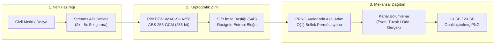

# 🌿 StegoCrypt PWA

<div align="center">


### İstemci Taraflı İstatistiksel Dirençli Steganografi, Kriptografi & Adli Bilişim Platformu

[](LICENSE)
[](#-test-ve-do%C4%9Frulama)
[](https://developer.mozilla.org/en-US/docs/Web/Progressive_web_apps)
[](https://en.wikipedia.org/wiki/Galois/Counter_Mode)
[](https://en.wikipedia.org/wiki/PBKDF2)
[](#-gizlilik-ve-tehdit-modeli)

*Görsellerde en önemsiz bit (LSB) manipülasyonu, istatistiksel dağıtım, χ² steganaliz röntgeni, zsteg 56-kombinasyon derin tarama ve görünmez metin şifreleme.*

</div>

---

## 📖 Genel Bakış

**StegoCrypt**, modern web platformu standartları (Web Crypto API, Streams API, OffscreenCanvas/Canvas, Service Worker) üzerinde çalışan, **%100 istemci tarafında (client-side)** ve sunucusuz (**zero-server**) bir steganografi ve adli bilişim (forensics) web uygulamasıdır.

Klasik steganografi araçlarının aksine açık metin dosya imzaları (`STEG`, `BM` vb.) bırakmaz; rastgeleleştirilmiş entropi başlığı, **kriptografik PRNG afin permütasyonu** ve **çift katmanlı inkâr edilebilir şifreleme** mimarisi içerir. Ayrıca adli analiz sekmesinde **LSB Bit Düzlemi Röntgeni** ve **Westfeld Pairs of Values $\chi^2$ Steganaliz Testi** ile taşıyıcı görsellerin istatistiksel anomalilerini raporlar.

Tasarımı, **Material 3 (Adaçayı Yeşili & Mat Kömür)** prensipleriyle kodlanmış olup masaüstü ve mobil ekranlarda duyarlı çalışır.

---

## 🛡️ Kriptografik ve Bilgi Teorisi Mimarisi



### 1. Kimlik Doğrulamalı Simetrik Kriptografi (AES-256-GCM & Format v3)
* **AES-256-GCM:** Kimlik doğrulamalı şifreleme (AEAD) ile hem gizlilik hem de bütünlük/özgünlük doğrulaması sağlanır.
* **Format v3 KDF & HKDF Mimarisi:** OWASP standartlarına uygun **600.000 iterasyonlu** tekil PBKDF2-HMAC-SHA256 ana anahtarı. Katmanlar ve afin permütasyon tohumları `HKDF-Expand` (`v3/all`, `v3/even`, `v3/odd`) ile $<0.1$ ms sürede genişletilir.
* **Taze Entropi & Ortak Salt:** Her şifrelemede `crypto.getRandomValues` ile 16 baytlık kriptografik rastgele **Salt** ve 12 baytlık **IV** üretilir. Çift katmanlı inkâr modunda tek bir ortak salt paylaşılarak çoklu-salt anomalisi önlenir.
* **Sıfır İmza (Zero-Signature):** Dosyada açık metin sihirli bayt (`magic string`) bulunmaz. Başlık ve gövde tekdüze sözde-rastgele bayt dizisi görünümündedir ($H \approx 8.0$ bit/bayt).
* **Erken Doğrulama:** Şifreli metadata bloğu AES-GCM kimlik doğrulama etiketiyle kilitlidir. Yanlış parola girildiğinde gövde verisi işlenmeden anında hata üretilerek DoS ve bellek tükenmesi (OOM) önlenir.
* **Geriye Dönük Uyumluluk:** Otomatik çözücü (`extractAuto`), Format v3 paketlerini, Format v2 (ZeroSig 100k) ve Format v1 (Sıralı) legacy paketlerini şeffaf biçimde tanır.

### 2. Yüksek Performanslı Web Worker & Saf PngCodec Mimarisi
* **Dedicated Web Worker Pipeline:** Ağır kriptografi (600.000 KDF), afin saçılım ve piksel işleme ana iş parçacığından (`UI thread`) tamamen izole arka plan Web Worker'ına (`workers/stego.worker.js`) devredilir. Arayüz daima 60 FPS akıcı kalır.
* **Sıfır-Kopyalama (Transferable Objects):** Görsel piksel tamponları (`ArrayBuffer`), bellek kopyalama maliyeti olmaksızın ($O(0)$ transfer) ana iş parçacığı ile Worker arasında aktarılır.
* **Saf JavaScript PNG Codec (`PngCodec`):** HTML5 `<canvas>` elemanının premultiplied alpha, sRGB renk uzayı yuvarlamaları veya tarayıcı farbling (parmak izi bozma) etkilerini baypas etmek için RFC 1950/1951 saf JavaScript PNG kodlayıcı ve çözücü geliştirilmiştir. Dışa aktarılan stego PNG dosyaları bit-exact kesinliktedir.

### 3. İstatiksel İnceleme Direnci, LSB Matching ($\pm 1$) & İçerik Duyarlı Dağıtım
* **LSB Matching ($\pm 1$ Embedding):** Klasik LSB yerine koyma (replacement) yönteminde pikseller asimetrik değişerek Değer Çiftleri (PoVs) dengesini bozar ve $\chi^2$ / RS analizine yakalanır. StegoCrypt v3'te pikselin en alt biti hedef bite eşit değilse değer simetrik olarak rastgele $\pm 1$ kaydırılır (0 ve 255 sınır korumalı). Böylece PoVs asimetrisi ve $R_M < R_{-M}$ kayması tamamen nötralize edilir.
* **Dama Tahtası (Checkerboard) Kafes Doku Dağıtımı (Content-Adaptive LSB):** Veriyi homojen pürüzsüz alanlara (gökyüzü, boş zemin) gömmeyi engeller. 2D Laplacian gradyanı ile hesaplanan en yüksek varyanslı piksellere veriyi odaklar. Çapa pikseller ($(x+y) \pmod 2 = 0$) ve `& 0xFE` üst-bit maskelemesi sayesinde alıcı-verici arasında 100% deterministik değişmezlik garantilenir.
* **Dinamik Stego Risk İndeksi:** Statik bpp yerine görselin dokulu alan kapasitesine göre "Düşük Risk", "Orta Risk", "Yüksek Tespit Riski" dinamik geri bildirimi verir.
* **PRNG Afin Saçılım:** Veri piksellerin başından itibaren sıralı gömülmez; HKDF tohumundan türetilen aralarında asal adımlarla ($O(1)$ bellek tüketimi) görselin tüm RGB kanallarına homojen dağıtılır.
* **1-LSB & 2-LSB Seçimi:** Yüksek istatistiksel direnç için 1-LSB; yüksek taşıma kapasitesi için 2-LSB modu (en yakın komşuluk $\pm 2$ eşlemesi ile).
* **Canvas Farbling Öz-Testi:** Açılışta test deseni çizilerek Brave Shields, Firefox RFP veya gizlilik eklentilerinin canvas verilerine gürültü ekleyip eklemediği denetlenir.

### 4. Deneysel / Yüksek Riskli İnkâr Modu (Plausible Deniability)
* Tek bir görsel içerisine iki bağımsız şifreli katman gömülür:
  * **Tuzak Katman (Decoy):** Baskı/zorlama anında teslim edilebilecek zararsız kılıf veri (`even` kanalları).
  * **Gerçek Katman (Real):** Asıl gizli veri (`odd` kanalları).
* > [!WARNING]
  > **Tespit Edilebilirlik vs. İnkâr Edilebilirlik Ödünleşimi (Trade-off):**
  > 1. Tuzak parolanın teslim edilmesi, adli analizciye görselin steganografi taşıdığını resmen bildirir.
  > 2. Tek kanallar boş bırakılırsa, çift ve tek kanallar arasındaki yerel varyans/entropi asimetrisi ikinci katmanın varlığına dair şüphe yaratabilir.
  > 3. Tek kanallar yapay gürültüyle doldurulursa, taşıyıcının tamamı manipüle edilmiş olacağından $\chi^2$ veya RS testleri gömmeyi doğrudan tespit edebilir.
  > Ayrıntılı analiz için [THREAT_MODEL.md](docs/THREAT_MODEL.md) belgesini inceleyin.

### 5. Bellek Sıfırlama Gerçekliği (Best-Effort Zeroization)
* Kriptografik ve piksel tamponları işlem tamamlandığında `Uint8Array.fill(0)` ile sıfırlanır.
* Ancak JavaScript çalışma zamanında (V8 / SpiderMonkey) HTML form alanlarından okunan parola string'leri heap bellekte immutable (değiştirilemez) nesneler olarak yaşar ve Garbage Collector (GC) temizleyene kadar RAM dökümünde kalabilir. İddia **"Best-Effort Memory Zeroization"** düzeyindedir.

---

## 📡 İletim Kanalı Kuralı (Carrier Channel Rule)

> [!IMPORTANT]
> **Kanal Kuralı:** Taşıyıcı PNG görselleri WhatsApp, Telegram, Signal gibi platformlar üzerinden iletilirken kesinlikle **"Fotoğraf"** olarak değil, **"Belge / Dosya (Kayıpsız)"** seçeneğiyle gönderilmelidir.
> Sosyal ağlar fotoğrafları kayıplı (lossy JPEG/WebP) olarak sıkıştırdığında piksellerin en önemsiz bitleri $\%40-\%60$ oranında bozulur ve mekânsal alanda hiçbir veri kurtarılamaz.

---

## 🔬 Adli Bilişim & Stego-Workbench Laboratuvarı

Uygulamanın **🔬 Steganaliz & Triyaj** sekmesi 4 entegre adli bilişim aracı sunar:

### 1. 🔬 LSB Röntgeni & İstatistiksel Steganaliz
* **LSB Bit Düzlemi Röntgeni:** Bit 0 ve Bit 1 düzlemlerini RGB veya tekil renk kanalları (Kırmızı, Yeşil, Mavi) bazında ayrıştırıp pikselleştirilmiş tuval üzerinde görselleştirir.
* **Westfeld Pairs of Values $\chi^2$ Testi:** Değer çiftlerinin ($2k, 2k+1$) frekans dağılımını ölçerek Wilson-Hilferty normalleştirilmiş dönüşümüyle LSB manipülasyon olasılığını ve $p$-değerini raporlar.
* **Fridrich RS (Regular/Singular) Steganaliz:** $2 \times 2$ piksel blokları ve ters çevirme maskeleri ($M, -M$) kullanarak LSB yerine koyma asimetrisini hesaplar; gizli veri yük oranını ($\hat{p}$) matematiksel olarak tahmin eder.
* **χ² Bölgesel Isı Haritası (Heatmap):** $32 \times 32$ blok kayan pencerelerle yerel steganografik anomali yoğunluğunu renkli yarı saydam katman olarak haritalandırır.

### 2. 📦 İkili Yapı & Dosya Triyajı (Binary Inspector)
* **Saf İkili Başlık Taraması:** HTML5 Canvas ve DOM ortamından bağımsız çalışan saf JavaScript DataView ayrıştırıcısı.
* **PNG & JPEG Yapı Analizi:** PNG chunk'ları (`IHDR`, `IDAT`, `IEND`, `tEXt`, `zTXt`, `iTXt`) ve Ethernet/PNG polinomlu CRC-32 sağlama toplamlarını doğrular; JPEG marker'larını (`SOI`, `APP1/EXIF`, `SOF0`, `COM`, `SOS`, `EOI`) raporlar.
* **Trailing Data / Overlay Injection (Polyglot) Tespiti:** Dosya sonlandırıcıdan (`IEND` veya `EOI`) sonra eklenen gizli ek verileri bayt düzeyinde tespit eder, bilinen imza veritabanıyla (ZIP, PDF, 7z, RAR) eşleştirir ve **tek tıkla indirme (payload export)** imkânı sunar.

### 3. ⚖️ Görsel Karşılaştırma & Fark Analizi (DiffEngine)
* **Kayıpsız / Nicel Kalite Ölçümü:** Orijinal Taşıyıcı (Cover) ve Şifreli (Stego) görselleri piksel düzeyinde karşılaştırır.
* **Metrikler:** Ortalama Hata Karesi (MSE), Tepe Sinyal-Gürültü Oranı (**PSNR** $\text{dB}$) ve $8 \times 8$ bloklu Yapısal Benzerlik İndeksi (**SSIM**).
* **Fark Görselleştirme:** Çarpanlı büyütülmüş fark haritası ($|I_1 - I_2| \times k$) ve yalnızca değişen bitleri altın sarısıyla işaretleyen **LSB Değişim Haritası**.

### 4. 👻 Görünmez Metin & ASCII Smuggling Dedektörü (ZeroWidthDetector)
* **Sıfır-Genişlikli Karakterler:** Metinlerde gizlenen ZWSP, ZWNJ, ZWJ, WJ, ZWNBSP ve görünmez karakterleri tespit eder.
* **BiDi Truva Atı Uyarısı:** Right-to-Left Override (`U+202E`, RLO) ve yönlendirme bayraklarını yakalayarak uzantı/kod gizleme saldırılarını ifşa eder.
* **Unicode Düzlem 14 ASCII Smuggling:** ChatGPT, LLM ve güvenlik filtrelerini atlatmak için kullanılan Unicode Tag (`\u{E0000}..\u{E007F}`) etiketlerini yakalar, gizlenen ASCII yükünü anında deşifre eder ve metni tüm görünmez parazitlerden arındırır.

### 5. 🕵️ zsteg Tarzı 56-Kombinasyon Derin Bit Düzlemi Tarayıcısı (ZstegScanner)
* **CTF ve Adli Analiz Standardı:** `zsteg` aracının modern istemci-taraflı Web Worker uygulaması.
* **56 Farklı Kombinasyon:** 7 renk kanalı (`r`, `g`, `b`, `rgb`, `bgr`, `rgba`, `abgr`), 2 bit derinliği (`1b`, `2b`), 2 bit sırası (`lsb`, `msb`) ve 2 piksel yönü (`xy`, `yx`).
* **Otomatik İmza & Bayrak Tespiti:** ZIP, PDF, PNG, JPEG, GIF, 7z, RAR, ELF, MZ/PE, `flag{...}` / `ctf{...}` regex kalıpları, JSON nesneleri ve basılabilir metin (%85+ ASCII).
* **Tek Tıkla Akış İndirme (Payload Export):** Herhangi bir şüpheli kombinasyonun tüm veri akışını tarayıcıda doğrudan dosya olarak indirme.

---

## 🧪 Test ve Doğrulama

Proje, hem Node.js yerel test ortamında birim testleriyle hem de Playwright ile gerçek Chromium tarayıcısında uçtan uca (E2E) test edilmektedir. Ayrıca GitHub Actions üzerinde **Node.js 20 ve 22** matrisinde otomatik CI işletilmektedir.

```bash
# Bağımlılıkları yükleyin
npm install

# 1. Birim Testleri (Crypto, Compression, Scatter, Stego, Steganalysis, ZeroWidth, Format v3, PngCodec, WorkerClient, Matching & RS, BinaryInspector, DiffEngine, ZeroWidthDetector, ZstegScanner)
npm run test:unit

# 2. Tarayıcı Uçtan Uca (E2E) Testleri (Playwright + Chromium)
npm run test:e2e
```

**Mevcut Test Durumu:**
- **61 / 61** Birim Testi Başarılı (`node:test`, ~1050 ms, %100 Başarı)
- **16 / 16** E2E Tarayıcı Testi Başarılı (Strict CSP, Şeffaf PNG, Dosya Gömme, İnkâr Modu, HEIC/HEIF, Web Worker Pipeline, PngCodec Bit-Exact, LSB Matching & RS analizi, İçerik Duyarlı Doku Kafesi & Stego Risk İndeksi, Binary Inspector & Overlay Injection, Diff Engine & PSNR/SSIM, Zero-Width & Unicode Plane 14 ASCII Smuggling, zsteg 56-Kombinasyon Taraması & Yük İndirme, PWA Service Worker Cache & Güncelleme Çubuğu)

---

## 📁 Teknik Dokümantasyon

- [BENCHMARK.md](docs/BENCHMARK.md) — LSB Replacement vs LSB Matching karşılaştırmalı $\chi^2$ ve Fridrich RS tespit oranları ve ampirik test bulguları.
- [THREAT_MODEL.md](docs/THREAT_MODEL.md) — Kerckhoffs ilkesi, saldırgan sınıfları, koruma sınırları ve kanal rehberi.
- [FORMAT.md](docs/FORMAT.md) — Format v1 (sıralı), Format v2 (sıfır imza dağınık) ve Format v3 spesifikasyonu ve test vektörleri.
- [SECURITY.md](SECURITY.md) — Güvenlik politikası ve sorumlu açık bildirimi (responsible disclosure).
- [THIRD_PARTY_NOTICES.md](THIRD_PARTY_NOTICES.md) — Lisans bildirimleri (heic2any MIT, libheif LGPL-3.0, jsQR Apache-2.0, qrcode-generator MIT).
- [VENDOR.md](docs/VENDOR.md) — Bağımlılık envanteri ve doğrulanmış SHA-256 kriptografik özetleri.

---

## 🚀 Yerel Çalıştırma

StegoCrypt tamamen statik web varlıklarından oluşur.

```bash
# Python ile:
python3 -m http.server 8080

# veya Node.js ile:
node tests/helpers/static-server.js
```

Tarayıcınızda `http://localhost:8080` adresini açın. PWA özellikleri için Service Worker otomatik devreye girer.

---

## 📄 Lisans

Bu proje [MIT Lisansı](LICENSE) altında sunulmuştur. Üçüncü taraf kütüphane bildirimleri için [THIRD_PARTY_NOTICES.md](THIRD_PARTY_NOTICES.md) dosyasına bakınız.