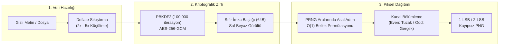

# 🌿 StegoCrypt PWA

<div align="center">


### İstemci Taraflı İnkâr Edilebilir Steganografi, Sıfır İmza Kriptografi & Görünmez Metin PWA

[](LICENSE)
[](https://developer.mozilla.org/en-US/docs/Web/Progressive_web_apps)
[](https://en.wikipedia.org/wiki/Galois/Counter_Mode)
[](https://en.wikipedia.org/wiki/PBKDF2)
[](#-gizlilik-ve-g%C3%BCvenlik-felsefesi)
[](#-geni%C5%9F-format--apple-heicheif-deste%C4%9Fi)

*Görsellerin derinliklerinde veriyi saklayın, matematiksel olarak varlığını inkar edin, LSB röntgeni ile analiz edin.*

</div>

---

## 📖 Genel Bakış

**StegoCrypt**, modern web teknolojileri (Web Crypto API, Streams API, Canvas, Service Worker) kullanılarak geliştirilmiş, **%100 istemci tarafında (client-side)** çalışan, sunucusuz (**zero-server**) bir siber güvenlik ve steganografi Progressive Web App'idir (PWA).

Klasik steganografi araçlarının aksine açık metin dosya imzaları (`STEG` vb.) taşımaz, veriyi doğrusal değil **kriptografik PRNG** ile saçar ve VeraCrypt benzeri **İnkâr Edilebilir Şifreleme (Plausible Deniability)** mimarisiyle baskı/zorlama senaryolarında matematiksel inkar güvencesi sunar.

Tasarımı, göz yormayan **Material 3 (Adaçayı Yeşili & Mat Siyah)** paletiyle hazırlanmış olup masaüstü ve mobilde kusursuz bir yerel uygulama deneyimi sunar.

---

## ✨ Temel Özellikler



### 1. 🛡️ Askeri Düzey Kriptografi & Sıfır İmza (Zero-Signature)
* **AES-256-GCM:** Kimlik doğrulamalı simetrik şifreleme (Authenticated Encryption with Associated Data).
* **PBKDF2 Anahtar Türetimi:** SHA-256 ile 100.000 iterasyon; kaba kuvvet (brute-force) saldırılarına karşı endüstri standardı koruma.
* **Taze Entropi:** Her şifrelemede `crypto.getRandomValues` ile 16 baytlık rastgele **Salt** ve 12 baytlık **IV** üretilir.
* **Sıfır İmza (Zero-Signature):** Dosyada açık metin "STEG" gibi sihirli baytlar (magic bytes) bulunmaz. 64 baytlık başlık (Salt + IV + Şifreli Meta + Body IV) saf rastgele gürültüden farksızdır ($H \approx 8.0$ bit/bayt). Parola bilinmeden dosyanın steganografi içerip içermediği kanıtlanamaz.
* **Erken Doğrulama & DoS Koruması:** 24 baytlık şifreli metadata bloğu AES-GCM kimlik doğrulama etiketiyle kilitlidir. Yanlış parolada bellek ayrılmadan mikrosaniyeler içinde reddedilir; OOM (bellek tükenmesi) kilitlenmelerini önler.

### 2. 🕵️ İnkâr Edilebilir Şifreleme (Plausible Deniability)
* **VeraCrypt Tarzı Çift Katman:** Tek bir görsel içerisine iki bağımsız şifreli katman gömülür:
  * **1. Katman (Tuzak / Decoy):** Baskı veya zorlama altında ifşa edilebilecek masum kılıf mesaj/dosya ve parolası (`even` renk kanalları).
  * **2. Katman (Gerçek / Real):** Asıl gizli mesaj/dosya ve parolası (`odd` renk kanalları).
* **Matematiksel Ayrıklık:** Çift ve tek kanallar küme teorisi gereği tamamen ayrıktır ($\{2k\} \cap \{2k+1\} = \emptyset$). Tuzak katmanı açan bir adli analizci, arka planda ikinci bir katman olduğunu kesinlikle kanıtlayamaz.

### 3. 🎲 PRNG Dağınık Piksel Şifreleme (Pixel Scattering)
* **Homojen Saçılım:** Veri piksellerin başından itibaren sıralı gömülmez; parolanın tohumundan türetilen aralarında asal adımlarla görselin tüm yüzeyine eşit olarak dağıtılır.
* **$O(1)$ Bellek Optimizasyonu:** Milyonlarca pikseli bellekte dizi olarak tutan hantal Fisher-Yates algoritmaları yerine, affine kongrüans üreteci ile $O(1)$ RAM kullanarak 4K görsellerde bile donma yapmadan çalışır.

### 4. 🔬 Faz 4: LSB Steganaliz & Röntgen Dedektörü
* **LSB Bit Düzlemi Röntgeni (Bit-Plane Visualizer):** Görselin Bit 0 ve Bit 1 düzlemlerini RGB, Kırmızı, Yeşil ve Mavi renk kanallarına ayırarak steganografi izlerini siyah-beyaz röntgen haritası olarak gösterir.
* **Westfeld-Pfitzmann Chi-Square ($\chi^2$) PoVs Testi:** Değer çiftlerinin (Pairs of Values: $2k, 2k+1$) frekans dağılımını ölçerek Wilson-Hilferty normalleştirilmiş dönüşümüyle LSB manipülasyon olasılığını ($p$-değeri) istatistiksel olarak hesaplar.

### 5. 🍏 Geniş Format & Apple HEIC/HEIF Desteği
* **İstemci Taraflı `heic2any`:** iPhone ve iPad'lerden yüklenen Apple `.heic` / `.heif` formatındaki fotoğraflar harici sunucuya gitmeden tarayıcı Web Worker'ı içinde otomatik olarak PNG'ye çevrilir.
* **Desteklenen Taşıyıcı Formatlar:** PNG, JPG, JPEG, WEBP, HEIC, HEIF, BMP ve GIF.
* **Her Türlü Gizli Dosya:** PDF, ZIP, DOCX, ses dosyaları, kaynak kodlar vb. tüm ikili (binary) dosyalar görsellerin içine gömülebilir ve orijinal adıyla geri indirilebilir.

### 6. 📱 QR Kod Üretici & Tarayıcı (QREngine)
* **Sıfır Genişlikli (Zero-Width) Unicode QR:** Görünmez şifreli mesajlar için tek tıkla QR Kod üretimi.
* **UTF-8 Bayt Koruması:** Standart QR kütüphanelerinin aksine `TextEncoder` entegrasyonu ile Türkçe karakterler ve görünmez Unicode (`\u200B`, `\u200C`, vb.) kayıpsız korunur.
* **Görselden QR Tarama:** Çözme sekmesinde ekran görüntüsü veya kamera fotoğrafından doğrudan QR kod okuma (`jsQR`).

### 7. 🗜️ Pre-Encryption Deflate Sıkıştırma
* Yerel Streams API (`CompressionStream('deflate')`) ile şifreleme öncesi veri sıkıştırılarak taşıyıcı görsel kapasitesi **2 ila 5 katına** çıkarılır.
* Kötü niyetli "Decompression Bomb" saldırılarına karşı **50 MB** tavan güvenlik sınırı içerir.

### 8. ⚡ 1-LSB & 2-LSB Çift Kapasite Modu
* **1-LSB (Yüksek Güvenlik):** Kanal başına 1 bit; istatistiksel olarak tespit edilmesi son derece zor.
* **2-LSB (Yüksek Kapasite):** Kanal başına 2 bit; görsel kalitesini bozmadan birkaç megabaytlık büyük dosyaların taşınmasını sağlar.
* **Otomatik Tespit:** Şifre çözücü, görselin 1-LSB mi yoksa 2-LSB mi olduğunu şifreli başlık sayesinde otomatik anlar; kullanıcıdan ayar istemez.

### 9. 👻 Görünmez Metin (Zero-Width Steganography)
* Görsel kullanmadan metinlerin içine görünmez Unicode karakterleri (`\u200B`, `\u200C`) ile şifreli veri gömer. WhatsApp, Telegram veya Signal gibi mesajlaşma platformlarının görsel sıkıştırma algoritmalarından etkilenmez.

### 10. 🔒 Sıkılaştırılmış Tarayıcı Güvenliği & Gizlilik
* **Strict CSP:** `connect-src 'self'` ile harici ağ çıkışı, veri sızıntısı veya telemetri tamamen imkansızdır.
* **Hassas Bellek Temizliği (Zeroization):** İşlem bittiğinde RAM'deki `Uint8Array` dizileri `buffer.fill(0)` ile sıfırlanır.
* **Panoyu Otomatik Temizleme:** Kopyalanan hassas mesajlar 30 saniye sonra panodan otomatik olarak silinir.
* **Dizin Atlama (Path Traversal) Koruması:** Çıkartılan dosya adları dizin ayraçlarından temizlenir.

---

## 📊 Klasik LSB Steganografi vs. StegoCrypt

| Özellik | Geleneksel LSB Araçları | StegoCrypt PWA |
| :--- | :--- | :--- |
| **İmza / Magic Bytes** | `STEG`, `BM`, `RIFF` gibi açık metin | ❌ **Sıfır İmza:** Saf beyaz gürültü başlığı |
| **Piksel Dağıtımı** | Doğrusal (Piksel 0, 1, 2...) | 🎲 **PRNG Dağınık ($O(1)$ Coprime Permütasyon)** |
| **İnkâr Edilebilirlik** | Yok (Tek parola, tek veri) | 🕵️ **VeraCrypt Çift Katman (Tuzak & Gerçek)** |
| **Steganaliz Koruması** | $\chi^2$ (Chi-square) testinde kolayca yakalanır | 🛡️ Homojen PRNG saçılımı ile tespit dirençli |
| **Steganaliz Röntgeni** | Yok | 🔬 **Dahili Bit-Plane Görselleştirici & $\chi^2$ Testi** |
| **Veri Sıkıştırma** | Genellikle yok | 🗜️ **Yerel Deflate (Bomb Korumalı)** |
| **Kapasite Seçimi** | Sabit 1-LSB | ⚡ **1-LSB / 2-LSB Çift Mod (Otomatik Tespit)** |
| **Apple HEIC Desteği**| Yok (Safari/iOS hatası) | 🍏 **İstemci Taraflı Otomatik Dönüşüm** |
| **QR Kod Entegrasyonu**| Yok | 📱 **UTF-8 & Zero-Width Destekli QR Motoru** |
| **Çalışma Modeli** | Çoğunlukla Python/Sunucu | 🌐 **%100 İstemci Taraflı PWA (Uçak Modu Uyumlu)** |

---

## 🚀 Kurulum ve Yerel Çalıştırma

StegoCrypt tamamen statik dosyalardan oluşur (HTML, CSS, Vanilla JS). Herhangi bir backend, node runtime veya veritabanı gerektirmez.

### 1. Depoyu Klonlayın
```bash
git clone https://github.com/VelliDR/stegocrypt-pwa.git
cd stegocrypt-pwa
```

### 2. Yerel Bir Sunucu ile Başlatın
Service Worker ve Web Crypto API güvenlik kuralları gereği uygulamanın `http://localhost` veya `https://` üzerinden sunulması gerekir:

```bash
# Python ile:
python3 -m http.server 8080

# veya Node.js ile:
npx serve .
```

Tarayıcınızda `http://localhost:8080` adresine gidin.

### 3. PWA Olarak Cihaza Yükleme
* **Chrome / Edge (Masaüstü):** Adres çubuğundaki "Uygulamayı Yükle" ikonuna tıklayın.
* **iOS Safari:** "Paylaş" > "Ana Ekrana Ekle" butonuna dokunun.
* **Android Chrome:** Seçenekler menüsünden "Uygulamayı Yükle" seçeneğini kullanın.
* Yüklendikten sonra internet bağlantınızı keserek (uçak modunda) test edebilirsiniz.

---

## 🛠️ Mimari ve Dizin Yapısı

```
stegocrypt-pwa/
├── index.html                   # Material 3 UI, CSP politikası ve erişilebilirlik
├── manifest.json                # PWA konfigürasyonu ve maskable ikon tanımları
├── sw.js                        # Service Worker (v6 önbellekleme ve çevrimdışı motor)
├── icon-192.png / icon-512.png  # PWA uygulama ikonları
├── js/
│   ├── app.js                   # UI olayları, orkestrasyon ve güvenlik kontrolleri
│   ├── CryptoEngine.js          # AES-256-GCM, PBKDF2 ve Sıfır İmza motoru
│   ├── StegoEngine.js           # LSB piksel gömücü, okuyucu ve otomatik çözücü
│   ├── ScatterEngine.js         # O(1) aralarında asal PRNG dağıtım motoru
│   ├── SteganalysisEngine.js    # LSB Bit Düzlemi Röntgeni & Chi-Square PoVs testi
│   ├── CompressionEngine.js     # Deflate sıkıştırma & Decompression bomb koruması
│   ├── ImageEngine.js           # Tuval ölçekleme & HEIC/HEIF otomatik dönüştürücü
│   ├── ZeroWidthEngine.js       # Sıfır genişlikli Unicode (ZWC) görünmez metin motoru
│   ├── QREngine.js              # UTF-8 ve ZWC destekli QR kod üretici & tarayıcı
│   └── vendor/
│       ├── heic2any.min.js      # İstemci taraflı Apple HEIC/HEIF çözücü
│       ├── qrcode.mjs           # Version 1-40 UTF-8 QR kod üreteci
│       └── jsQR.js              # Saf JS QR kod okuyucu
```

---

## ⚠️ Sorumluluk Reddi (Disclaimer)

Bu yazılım yalnızca **eğitim, akademik araştırma ve meşru gizlilik koruma** amaçlarıyla geliştirilmiştir. Kullanıcıların yerel yasaları ihlal eden veya kötü niyetli eylemlerinden yazılım geliştiricileri sorumlu tutulamaz.

---

## 📄 Lisans

Bu proje [MIT Lisansı](LICENSE) altında lisanslanmıştır. Dilediğiniz gibi kullanabilir, katkıda bulunabilir ve çatallayabilirsiniz.