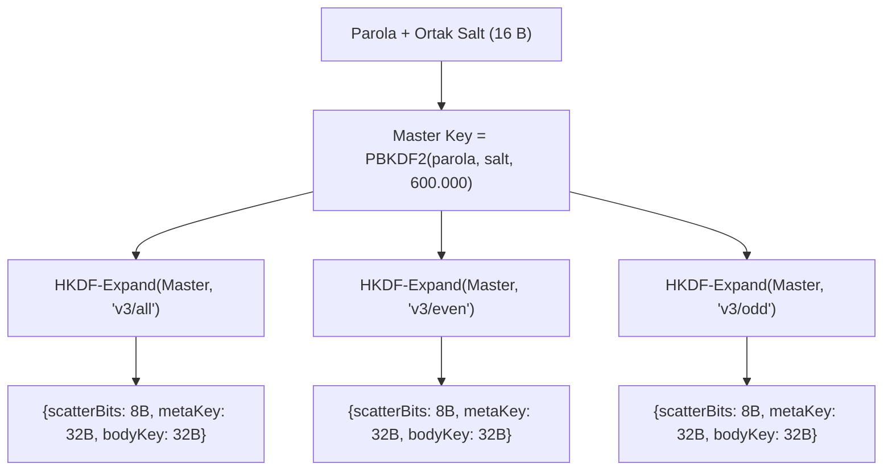
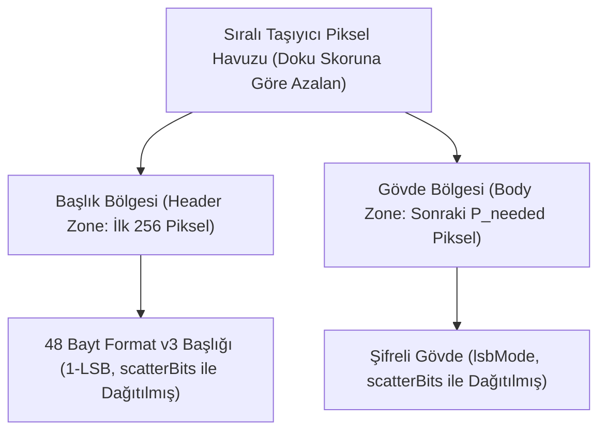

# StegoCrypt Bitstream ve Paket Format Spesifikasyonu (FORMAT.md)

Bu belge, StegoCrypt sisteminde kullanılan veri paketlerinin, şifreli başlıkların ve bit düzeyindeki gömme formatlarının teknik spesifikasyonudur.

---

## 1. Format v1: Sıralı Başlık Formatı (Sequential)

Sıralı mod, taşıyıcı görselin piksellerine tarama sırasıyla (satır satır, RGB kanalları) veri gömer.

### 1.1 Başlık Yapısı (36 Bayt)

| Bayt Ofseti | Boyut | Alan | Açıklama |
|---|---|---|---|
| `0..3` | 4 B | `Magic` | ASCII: `"STG1"` (1-LSB) veya `"STG2"` (2-LSB) |
| `4..7` | 4 B | `CipherLen` | Şifreli gövde uzunluğu (Uint32, Big-Endian) |
| `8..23` | 16 B | `Salt` | PBKDF2 anahtar türetme tuzu (kriptografik rastgele) |
| `24..35` | 12 B | `IV` | AES-GCM başlatma vektörü (kriptografik rastgele) |
| `36..` | $N$ B | `Ciphertext` | AES-256-GCM şifreli metin + 16 bayt Auth Tag |

### 1.2 Gömme Kuralları
- Başlık (`36 bayt = 288 bit`), daima **1-LSB** ile yazılır.
- Gövde, seçilen `lsbMode` değerine göre (1-LSB veya 2-LSB) kalan piksellerin RGB kanallarına gömülür.
- Alfa kanalı ($i \equiv 3 \pmod 4$) asla değiştirilmez.

---

## 2. Format v2: Sıfır İmza Dağınık Format (Zero-Signature Scattered)

Sıfır İmza formatı, görsel içinde hiçbir açık metin başlık (`magic`) bırakmaz. 64 baytlık başlık dahil tüm veri şifreli ve sözde-rastgele gürültü görünümündedir.

### 2.1 Başlık Yapısı (64 Bayt)

| Bayt Ofseti | Boyut | Alan | Açıklama |
|---|---|---|---|
| `0..15` | 16 B | `Salt` | PBKDF2 anahtar türetme tuzu |
| `16..27` | 12 B | `IV Meta` | Metadata bloğu için AES-GCM IV |
| `28..51` | 24 B | `Encrypted Meta` | Şifreli meta (8 B açık veri + 16 B GCM Auth Tag) |
| `52..63` | 12 B | `IV Body` | Şifreli gövde için AES-GCM IV |

#### Şifreli Meta Bloğu Açık Metin Yapısı (8 Bayt):
- `[0..1]`: `0x53, 0x47` (ASCII: `"SG"`)
- `[2]`: `lsbMode` (`0x01` veya `0x02`)
- `[3]`: Rezerve (`0x00`)
- `[4..7]`: `CipherBodyLen` (Uint32, Big-Endian)

### 2.2 Dağıtım Motoru (ScatterEngine Permütasyonu)
Piksel indeksleri afin permütasyon ile seçilir:
$$P(i) = (c_0 + i \cdot \text{step}) \pmod{n_{\text{partition}}}$$

Parametreler PBKDF2 üzerinden türetilir:
- $\text{Tohum} = \text{PBKDF2}(\text{password}, \text{salt}=\text{"StegoCrypt\_PRNG\_Scatter\_V2"}, \text{iter}=1000)$
- $\gcd(\text{step}, n_{\text{partition}}) = 1$ koşulu sağlanarak permütasyonun birebir ve örten (bijective) olması garanti edilir.

---

## 3. Format v3: Tek KDF & HKDF Çoklu Katman (Faz 2 Spesifikasyonu)

Format v3'te her katman için ayrı PBKDF2 çalıştırma maliyeti tamamen ortadan kaldırılmıştır. 16 baytlık genel tuz (public salt) görselin ilk 128 kanalına yerleştirilir; ardından tek bir 600.000 iterasyonlu PBKDF2-HMAC-SHA256 ana KDF çalıştırılarak HKDF (`HMAC-SHA-256`) ile alt-anahtarlar anında türetilir:

### 3.1 Paket Mimarisi

1. **Ortak Salt Bloğu (16 Bayt = 128 Kanal):** Taşıyıcının ilk 128 RGB kanalına 1-LSB ile yazılır. Çift katmanlı inkâr modunda dahi tek bir ortak salt paylaşılır; bu sayede adli analizci çift salt anomalisi yakalayamaz.
2. **Dağınık Başlık Bloğu (48 Bayt = 384 Kanal):** HKDF `scatterBits` tohumundan türetilen afin permütasyon indislerine 1-LSB ile dağıtılır:
   - `0..11` (12 B): `IV Meta`
   - `12..35` (24 B): `Encrypted Meta` (8 B açık veri: `[0x53, 0x47, lsbMode, 0x00, CipherBodyLen]` + 16 B AES-GCM Auth Tag)
   - `36..47` (12 B): `IV Body`
3. **Şifreli Gövde:** `lsbMode` (1-LSB veya 2-LSB) ile seçilen afin permütasyon indislerine gömülür.
4. **Pure JS PNG Codec (`PngCodec`):** Üretilen piksel matrisi doğrudan RFC 1950/1951 saf JavaScript PNG kodlayıcısıyla dosya haline getirilir; HTML5 Canvas'ın renk profili ve alfa yuvarlama tahrifatları sıfırlanır.

---

## 4. Format v3: İçerik Duyarlı Dağıtım Modu (Faz 4 Spesifikasyonu)

Format v3, homojen PRNG dağıtımının yanı sıra **Dama Tahtası (Checkerboard) Çapa-Taşıyıcı Kafes Mimarisi** üzerinde çalışan içerik duyarlı (content-adaptive) gömme modunu destekler. Bu mod, düz/pürüzsüz alanlara (gökyüzü, homojen duvarlar) veri gömülmesini engeller ve veriyi yalnızca yüksek varyanslı doku/kenar bölgelerine yoğunlaştırır.

### 4.1 Dama Tahtası Kafes ve Çapa-Taşıyıcı Ayrımı

Alıcı ve verici arasında sıfır-iletişimli deterministik senkronizasyon (sorting invariance) sağlamak amacıyla pikseller iki ayrık gruba ayrılır:
1. **Çapa Pikseller (Anchor Pixels):** $(x + y) \pmod 2 = 0$. Bu pikseller kesinlikle salt okunurdur ve yük verisiyle değiştirilmez. Üst-bit maskelemesi (`& 0xFE`) ile okunarak 100% bit-exact değişmezlik sağlanır.
2. **Taşıyıcı Pikseller (Payload Pixels):** $(x + y) \pmod 2 = 1$. Yalnızca bu pikseller doku analiziyle sıralanır ve şifreli veriyi taşır.

### 4.2 2D Laplacian Doku Skorlama ve Kararlı Sıralama

Her iç taşıyıcı piksel için 4 ortogonal çapa komşusu (Kuzey, Güney, Batı, Doğu) üzerinden gradyan hesaplanır:
$$\text{Skor}(x, y) = \sum_{c \in \{R, G, B\}} \left( |(N_c \ \& \ \text{0xFE}) - (S_c \ \& \ \text{0xFE})| + |(E_c \ \& \ \text{0xFE}) - (W_c \ \& \ \text{0xFE})| \right)$$

Pikseller doku skorlarına göre azalan sırada kararlı (stable) sıralanır; eşitlik durumunda piksel indeksi ikincil anahtar (tie-breaker) olarak kullanılır.

### 4.3 Başlık ve Gövde Bölgesi Bölümlendirmesi

1. **Başlık Bölgesi (Header Zone):** En yüksek dokulu ilk 256 piksel ($256 \times 3 = 768$ kanal) başlık için ayrılır. Alıcı taraf yük boyutunu henüz bilmediğinden, daima ilk 256 pikseli okuyarak 48 baytlık başlığı çözer.
2. **Gövde Bölgesi (Body Zone):** Başlıktan çözülen `cipherLen` bayt miktarına göre gereken $P_{\text{needed}}$ piksel, sıralı havuzun 256. indeksinden itibaren tahsis edilir.
3. Alıcı ve verici aynı $P_{\text{needed}}$ piksel kümesini ve aynı afin permütasyon indislerini üreterek şifreyi çözer.

---

## 5. Referans Test Vektörleri

Aşağıdaki test vektörü, bağımsız kütüphanelerin uyumluluğunu test etmek için kullanılabilir:

### Test Vektörü: Format v1 (Sıralı 1-LSB)
- **Açık Metin (Plaintext):** `"StegoCrypt Test 2026"` (20 bayt UTF-8)
- **Parola:** `"CorrectHorseBatteryStaple"`
- **Salt (Hex, 16B):** `000102030405060708090a0b0c0d0e0f`
- **IV (Hex, 12B):** `a0a1a2a3a4a5a6a7a8a9aaab`
- **Türetilen Anahtar (PBKDF2-100k, Hex):**
  `08713063f23a5e840a0c64c767f407768ad33b3846ce24204c3c3942fc17a7a2`
- **Ciphertext + Tag (36B Hex):**
  `1c36001fffc8f09d85489f664a7c06eb6ca9cb0bc7f5979ff20311f99c9c82ee30ad43be`
- **Tam Paket Başlığı (36B Hex):**
  `5354473100000024000102030405060708090a0b0c0d0e0fa0a1a2a3a4a5a6a7a8a9aaab`

---

## 6. Faz 5: Stego-Workbench & Adli Triyaj Spesifikasyonu

Faz 5, StegoCrypt'i kapsamlı bir adli inceleme ve analiz laboratuvarına dönüştürür.

### 6.1 İkili Yapı (Binary Inspector) & Trailing Overlay Tespiti
DOM ve Canvas ortamından bağımsız çalışan ikili analizci (`BinaryInspector.js`), dosya başlıklarını ve sonlandırıcılarını inceler:

1. **PNG Chunk Denetimi:**
   - 8 baytlık PNG imzası (`89 50 4E 47 0D 0A 1A 0A`) doğrulanır.
   - Tüm chunk'lar (`IHDR`, `PLTE`, `IDAT`, `tEXt`, `zTXt`, `iTXt`, `IEND`) taranır.
   - Her chunk için Ethernet/PNG polinomu $P(x) = \text{0xEDB88320}$ ile CRC-32 sağlama toplamı hesaplanıp `chunk.crc` ile karşılaştırılır.
2. **Trailing Data (Overlay Injection / Polyglot) Tespiti:**
   - Standart PNG dosyalarında `IEND` chunk'ının bitiş ofseti ($O_{\text{iend}} = \text{offset} + 12$) dosya boyutuna eşit olmalıdır ($O_{\text{iend}} = L$).
   - Benzer şekilde JPEG dosyalarında `EOI` (`0xFFD9`) marker'ının sonu dosya boyutuna eşit olmalıdır ($O_{\text{eoi}} = L$).
   - Eğer $O < L$ ise, dosya sonlandırıcıdan sonra eklenmiş veri (trailing data) kesin olarak saptanır:
     $$\text{Overlay Boyutu} = L - O$$
   - Ek verinin ilk baytları bilinen imza veritabanıyla (ZIP: `PK\x03\x04`, PDF: `%PDF-`, 7z: `7z\xBC\xAF\x27\x1C`, RAR: `Rar!\x1A\x07`) eşleştirilerek dosya türü teşhis edilir ve tek tıkla dışa aktarılır.

### 6.2 Görsel Fark Analizi & Sadakat Metrikleri (DiffEngine)
Taşıyıcı (Cover, $I_1$) ve Şifreli (Stego, $I_2$) görseller piksel düzeyinde karşılaştırılır:

1. **MSE (Mean Squared Error):**
   $$\text{MSE} = \frac{1}{3 W H} \sum_{x=1}^{W} \sum_{y=1}^{H} \sum_{c \in \{R,G,B\}} (I_1(x,y,c) - I_2(x,y,c))^2$$
2. **PSNR (Peak Signal-to-Noise Ratio):**
   $$\text{PSNR} = 10 \cdot \log_{10}\left(\frac{255^2}{\text{MSE}}\right) \quad (\text{MSE} = 0 \implies \infty)$$
3. **SSIM (Structural Similarity Index Measure):**
   Standart $8 \times 8$ bloklar ve lüminans ($Y = 0.299R + 0.587G + 0.114B$) üzerinde hesaplanır ($C_1 = 6.5025, C_2 = 58.5225$):
   $$\text{SSIM}(x, y) = \frac{(2\mu_x\mu_y + C_1)(2\sigma_{xy} + C_2)}{(\mu_x^2 + \mu_y^2 + C_1)(\sigma_x^2 + \sigma_y^2 + C_2)}$$
4. **Büyütülmüş Fark Haritası:** $|I_1(x,y) - I_2(x,y)| \times k$ çarpanı ile görselleştirilir ($k \in [5, 100]$).
5. **LSB Düzlem Değişim Haritası:** Sadece en alt biti ($b_0$) değişen pikseller parlak altın sarısı (`#FFD700`) ile işaretlenir; değişmeyen pikseller koyulaştırılmış gri arka planda sunulur.

### 6.3 Görünmez Karakter, BiDi Trojan ve ASCII Smuggling (ZeroWidthDetector)
Metin tabanlı adli inceleme modülü:
1. **Sıfır-Genişlikli Karakterler:** ZWSP (`U+200B`), ZWNJ (`U+200C`), ZWJ (`U+200D`), WJ (`U+2060`), ZWNBSP (`U+FEFF`), MVS (`U+180E`), SHY (`U+00AD`) ve görünmez matematik operatörleri taranır.
2. **BiDi Truva Atı Saldırıları:** Right-to-Left Override (`U+202E`, RLO), LRO, RLE, LRE gibi yönlendirme bayrakları tespit edilerek uzantı/kod gizleme girişimleri uyarılır.
3. **Unicode Düzlem 14 ASCII Smuggling:**
   - Unicode Tag aralığı: $\text{U+E0000} .. \text{U+E007F}$.
   - Tag karakteri $cp \in [\text{0xE0020}, \text{0xE007E}]$ için açık ASCII karakteri:
     $$\text{Char} = \text{String.fromCharCode}(cp - \text{0xE0000})$$
   - Kaçırılan gizli ASCII istemi/yükü anında deşifre edilerek ekrana dökülür; metin tüm görünmez parazitlerden arındırılarak temiz haliyle sunulur.

