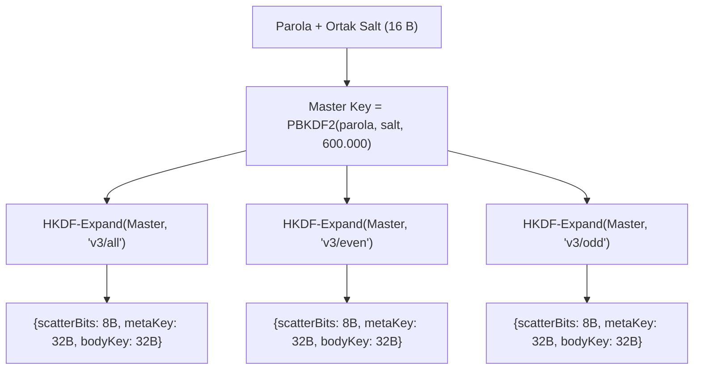

# StegoCrypt Bitstream ve Paket Format Spesifikasyonu (FORMAT.md)

Bu belge, StegoCrypt sisteminde kullanılan veri paketlerinin, şifreli başlıkların ve bit düzeyindeki gömme formatlarının teknik spesifikasyonudur.

---

## 1. Format v1: Sıralı Başlık Formatı (Sequential)

Sıralı mod, taşıyıcı görselin piksellerine tarama sırasıyla (satır satır, RGB kanalları) veri gömer.

### 1.1 Başlık Yapısı (36 Bayt)

| Bayt Ofseti | Boyut | Alan | Açıklama |
|---|---|---|---|
| `0..3` | 4 B | `Magic` | ASCII: `"STG1"` (1-LSB) veya `"STG2"` (2-LSB) |
| `4..7` | 4 B | `CipherLen` | Şifreli gövde uzunluğu (Uint32, Big-Endian) |
| `8..23` | 16 B | `Salt` | PBKDF2 anahtar türetme tuzu (kriptografik rastgele) |
| `24..35` | 12 B | `IV` | AES-GCM başlatma vektörü (kriptografik rastgele) |
| `36..` | $N$ B | `Ciphertext` | AES-256-GCM şifreli metin + 16 bayt Auth Tag |

### 1.2 Gömme Kuralları
- Başlık (`36 bayt = 288 bit`), daima **1-LSB** ile yazılır.
- Gövde, seçilen `lsbMode` değerine göre (1-LSB veya 2-LSB) kalan piksellerin RGB kanallarına gömülür.
- Alfa kanalı ($i \equiv 3 \pmod 4$) asla değiştirilmez.

---

## 2. Format v2: Sıfır İmza Dağınık Format (Zero-Signature Scattered)

Sıfır İmza formatı, görsel içinde hiçbir açık metin başlık (`magic`) bırakmaz. 64 baytlık başlık dahil tüm veri şifreli ve sözde-rastgele gürültü görünümündedir.

### 2.1 Başlık Yapısı (64 Bayt)

| Bayt Ofseti | Boyut | Alan | Açıklama |
|---|---|---|---|
| `0..15` | 16 B | `Salt` | PBKDF2 anahtar türetme tuzu |
| `16..27` | 12 B | `IV Meta` | Metadata bloğu için AES-GCM IV |
| `28..51` | 24 B | `Encrypted Meta` | Şifreli meta (8 B açık veri + 16 B GCM Auth Tag) |
| `52..63` | 12 B | `IV Body` | Şifreli gövde için AES-GCM IV |

#### Şifreli Meta Bloğu Açık Metin Yapısı (8 Bayt):
- `[0..1]`: `0x53, 0x47` (ASCII: `"SG"`)
- `[2]`: `lsbMode` (`0x01` veya `0x02`)
- `[3]`: Rezerve (`0x00`)
- `[4..7]`: `CipherBodyLen` (Uint32, Big-Endian)

### 2.2 Dağıtım Motoru (ScatterEngine Permütasyonu)
Piksel indeksleri afin permütasyon ile seçilir:
$$P(i) = (c_0 + i \cdot \text{step}) \pmod{n_{\text{partition}}}$$

Parametreler PBKDF2 üzerinden türetilir:
- $\text{Tohum} = \text{PBKDF2}(\text{password}, \text{salt}=\text{"StegoCrypt\_PRNG\_Scatter\_V2"}, \text{iter}=1000)$
- $\gcd(\text{step}, n_{\text{partition}}) = 1$ koşulu sağlanarak permütasyonun birebir ve örten (bijective) olması garanti edilir.

---

## 3. Format v3: Tek KDF & HKDF Çoklu Katman (Faz 2 Spesifikasyonu)

Format v3'te her katman için ayrı PBKDF2 çalıştırma maliyeti tamamen ortadan kaldırılmıştır. 16 baytlık genel tuz (public salt) görselin ilk 128 kanalına yerleştirilir; ardından tek bir 600.000 iterasyonlu PBKDF2-HMAC-SHA256 ana KDF çalıştırılarak HKDF (`HMAC-SHA-256`) ile alt-anahtarlar anında türetilir:

### 3.1 Paket Mimarisi

1. **Ortak Salt Bloğu (16 Bayt = 128 Kanal):** Taşıyıcının ilk 128 RGB kanalına 1-LSB ile yazılır. Çift katmanlı inkâr modunda dahi tek bir ortak salt paylaşılır; bu sayede adli analizci çift salt anomalisi yakalayamaz.
2. **Dağınık Başlık Bloğu (48 Bayt = 384 Kanal):** HKDF `scatterBits` tohumundan türetilen afin permütasyon indislerine 1-LSB ile dağıtılır:
   - `0..11` (12 B): `IV Meta`
   - `12..35` (24 B): `Encrypted Meta` (8 B açık veri: `[0x53, 0x47, lsbMode, 0x00, CipherBodyLen]` + 16 B AES-GCM Auth Tag)
   - `36..47` (12 B): `IV Body`
3. **Şifreli Gövde:** `lsbMode` (1-LSB veya 2-LSB) ile seçilen afin permütasyon indislerine gömülür.
4. **Pure JS PNG Codec (`PngCodec`):** Üretilen piksel matrisi doğrudan RFC 1950/1951 saf JavaScript PNG kodlayıcısıyla dosya haline getirilir; HTML5 Canvas'ın renk profili ve alfa yuvarlama tahrifatları sıfırlanır.

---

## 4. Referans Test Vektörleri

Aşağıdaki test vektörü, bağımsız kütüphanelerin uyumluluğunu test etmek için kullanılabilir:

### Test Vektörü: Format v1 (Sıralı 1-LSB)
- **Açık Metin (Plaintext):** `"StegoCrypt Test 2026"` (20 bayt UTF-8)
- **Parola:** `"CorrectHorseBatteryStaple"`
- **Salt (Hex, 16B):** `000102030405060708090a0b0c0d0e0f`
- **IV (Hex, 12B):** `a0a1a2a3a4a5a6a7a8a9aaab`
- **Türetilen Anahtar (PBKDF2-100k, Hex):**
  `08713063f23a5e840a0c64c767f407768ad33b3846ce24204c3c3942fc17a7a2`
- **Ciphertext + Tag (36B Hex):**
  `1c36001fffc8f09d85489f664a7c06eb6ca9cb0bc7f5979ff20311f99c9c82ee30ad43be`
- **Tam Paket Başlığı (36B Hex):**
  `5354473100000024000102030405060708090a0b0c0d0e0fa0a1a2a3a4a5a6a7a8a9aaab`
