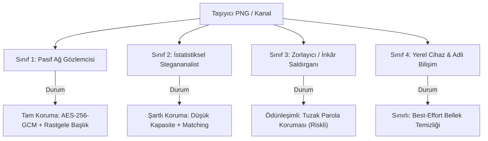

# StegoCrypt Tehdit Modeli ve Güvenlik Sınırları (THREAT_MODEL.md)

Bu belge, **StegoCrypt** projesinin kriptografik, steganografik ve operasyonel güvenlik sınırlarını, literatür standartlarına ve **Kerckhoffs İlkesi**'ne tam uyumlu olarak tanımlar.

---

## 1. Temel İlke: Kerckhoffs Prensibi

> *"Bir kriptografik ve steganografik sistemin güvenliği, algoritmanın gizliliğine değil; yalnızca anahtarın (parolanın) gizliliğine ve taşıyıcı kanalın istatistiksel doğallığına dayanmalıdır."*

StegoCrypt tamamen açık kaynaklıdır. Saldırganın:
1. Kaynak kodun tamamını bildiği,
2. Kullanılan PRNG tohumlama, permütasyon ve bit düzlemi eşleme kurallarına sahip olduğu,
3. Bitstream formatının (`FORMAT.md`) tüm bayt yapılarını bildiği,
4. Uygulamada "İnkâr Edilebilir Çift Katman" (Deniable Mode) seçeneğinin bulunduğunu bildiği varsayılır.

Güvenlik iddiaları hiçbir koşulda *"saldırgan bu aracı kullandığımızı tahmin edemez"* varsayımına dayandırılamaz.

---

## 2. Saldırgan Sınıfları ve Koruma Sınırları

StegoCrypt, dört farklı saldırgan profiline karşı değerlendirilir:

### Sınıf 1: Pasif Ağ Gözlemcisi (ISP, Güvenlik Duvarı, Ağ Dinleyicisi)
- **Yetenek:** Ağdan geçen dosyanın boyutunu, MIME türünü, PNG chunk yapısını ve aktarım protokolünü inceler.
- **Koruma:** **Tam Korumalı.**
  - `Format v2 / v3` başlıklarında açık metin sihirli bayt (`magic string`) bulunmaz.
  - Şifreli veri AES-256-GCM çıktısı olup saf sözde-rastgele gürültü biçimindedir.
  - Açık başlık imzası bulunmadığı için basit kural tabanlı (DPI/Snort/YARA) ağ filtreleri dosyanın stego olduğunu imza ile tespit edemez.

### Sınıf 2: Hedefli İstatistiksel Stegananalist
- **Yetenek:** Görseli $\chi^2$ (Chi-Square PoVs), RS (Regular/Singular), WS (Weighted Stego-image), SPA (Sample Pair Analysis) testlerine tabi tutar veya eğitilmiş derin öğrenme modelleri (SRNet, Xu-Net) ile inceler.
- **Koruma:** **Şartlı Koruma (Gömme Oranı ve Algoritmaya Bağlı).**
  - **LSB Replacement:** Yüksek gömme oranlarında ($>0.1$ bpp) $\chi^2$ ve RS analizine karşı kırılgandır.
  - **LSB Matching ($\pm 1$):** Değer çiftleri asimetrisini ortadan kaldırır; klasik $\chi^2$ ve temel RS testlerine karşı istatistiksel direnç sağlar.
  - **Kapasite ve Karekök Yasası (Ker, 2007):** Görsel boyutu $N$ piksel olduğunda, güvenli yük boyutu doğrusal değil $\mathcal{O}(\sqrt{N})$ ile ölçeklenir. Taşıyıcı kapasitesinin $\%10$'undan fazlası doldurulduğunda modern zengin modeller (Spatial Rich Models - SRM) anomali tespit edebilir.
  - **Garanti Yok:** Makine öğrenimi tabanlı modern sınıflandırıcılara karşı mutlak tespit edilemezlik garantisi matematiksel olarak verilemez.

### Sınıf 3: Zorlayıcı Saldırgan (Duress / Rubber-Hose Cryptanalysis)
- **Yetenek:** Kullanıcıyı parolayı vermeye zorlar. Kullanıcının StegoCrypt kullandığını ve inkâr modu özelliğini bilir.
- **Koruma:** **Deneysel / Yüksek Riskli İnkâr Modu (Ayrıntılar Bölüm 3'te).**
  - Kullanıcı "Tuzak Parola"yı verdiğinde sistem zararsız bir metin/dosya çözer.
  - Ancak tuzak parolanın teslim edilmesi, adli analiste dosyanın stego taşıdığını resmen itiraf etmektir.
  - Eğer ikinci katman (odd kanalları) doldurulmamışsa, odd kanalları ile even kanalları arasındaki lokal entropi ve varyans farkı ikinci katmanın varlığını ele verir.
  - Eğer odd kanalları yapay gürültüyle doldurulursa, taşıyıcının tamamı manipüle edilmiş olur ve Sınıf 2 saldırganına karşı tespit riski tavan yapar.

### Sınıf 4: Yerel Cihaz & Adli Bilişim Saldırganı (Forensics Examiner)
- **Yetenek:** Kullanıcının bilgisayarına, tarayıcı önbelleğine, RAM dökümüne veya disk swap alanına fiziksel/yönetici erişimine sahiptir.
- **Koruma:** **Sınırlı (Tarayıcı Çalışma Zamanı Kısıtları).**
  - StegoCrypt tamamen istemci tarafında çalışır, sunucuya hiçbir veri göndermez.
  - Kriptografik işlemler sonrası `Uint8Array.fill(0)` ile açık tamponlar temizlenir (**Best-Effort Zeroization**).
  - Ancak JavaScript V8/SpiderMonkey motorlarında HTML `<input type="password">` değerleri immutable (değiştirilemez) string olarak heap belleğe yazılır ve Garbage Collector (GC) nesneyi temizleyene kadar RAM dökümünde kalabilir.
  - Tarayıcı geçmişi ve indirilen dosyalar yerel diskte iz bırakabilir.

---

## 3. İnkâr Edilebilirlik ve Tespit Edilebilirlik Ödünleşimi (Trade-Off)

İnkâr Edilebilir Şifreleme (Plausible Deniability), steganografide çift ucu keskin bir kılıçtır.

| Yaklaşım | İnkâr Kabiliyeti | İstatistiksel Tespit Riski | Açıklama |
|---|---|---|---|
| **Tekil Dağınık Mod (`all`)** | Yok (Parola tek) | **En Düşük Risk** | Yük tüm piksellere minimum yoğunlukla homojen yayılır. |
| **İnkâr Modu (Boş Katmanlı)** | Yüksek (Tuzak var) | **Orta-Yüksek Risk** | Çift kanallar tuzak veri taşırken tek kanallar doğal kalırsa, kanallar arası varyans asimetrisi adli incelemede şüphe doğurur. |
| **İnkâr Modu (Yapay Gürültülü)** | Yüksek (Tuzak var) | **Kritik Risk** | İkinci katman rastgele bitlerle doldurulursa, görselin %100 LSB'si değişmiş olur; $\chi^2$ veya RS testi %100 olasılıkla yakalar. |

> **Öneri:** Gerçek operasyonel gizlilikte, tekil ve düşük kapasiteli gömme (`all` modu, $\le 0.05$ bpp) tercih edilmelidir. İnkâr modu yalnızca fiziksel zorlama tehdidinin istatistiksel analiz tehdidinden daha yüksek olduğu özel senaryolarda kullanılmalıdır.

---

## 4. İletim Kanalı ve Taşıyıcı Hijyeni (Carrier OPSEC)

### 1. Kayıplı Sosyal Medya İletimi
WhatsApp, Telegram, Signal, Instagram vb. mesajlaşma platformları "Fotoğraf" olarak gönderilen görselleri otomatik olarak JPEG veya WebP formatında sıkıştırır ve yeniden boyutlandırır.
- **Sonuç:** Mekânsal alanda (Spatial Domain) LSB'lerin $\%40-\%60$'ı rastgele değişir veya sıfırlanır. Hiçbir hata düzeltme kodu (Reed-Solomon vb.) bu düzeyde bir bozulmayı kurtaramaz.
- **Kural:** Taşıyıcı PNG dosyaları mesajlaşma ağlarında kesinlikle **"Belge / Dosya (Kayıpsız / Uncompressed File)"** seçeneğiyle aktarılmalıdır.

### 2. JPEG Kökenli Taşıyıcı Anomalisi
Fotoğraf makinelerinden çıkan JPEG fotoğraflar PNG formatına dönüştürülüp LSB gömme yapıldığında:
- Görselde $8 \times 8$ DCT blok sıkıştırma izleri kalır.
- LSB manipülasyonu, "JPEG Uyumluluk Steganalizi" (Fridrich, 2001) tarafından kolayca yakalanır.
- Ayrıca EXIF metaverisi temizlenmiş, ancak kamera çözünürlüğünde olan bir PNG dosyası adli analist için kendi başına bir anomalidir.
- **Kural:** Doğal olarak PNG olan görseller (ekran görüntüleri, dijital grafikler, diyagramlar) fotoğraf makinelerinden dönüştürülmüş JPEG'lere kıyasla çok daha güvenli taşıyıcılardır.

### 3. Tarayıcı Parmak İzi ve Canvas Farbling
Brave Shields, Firefox RFP (`privacy.resistFingerprinting`) ve Safari Gelişmiş Takip Koruması, `getImageData()` çağrılarına mikro-gürültü ekler.
- Bu gürültü LSB bitlerini bozar ve şifre çözmeyi engeller.
- StegoCrypt, başlangıçta bir **Canvas Bütünlük Testi** çalıştırarak farbling tespit edilirse kullanıcıyı uyarır.
